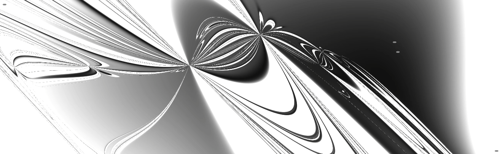
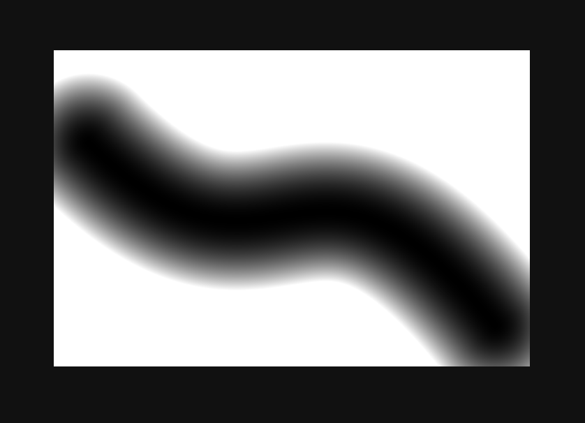
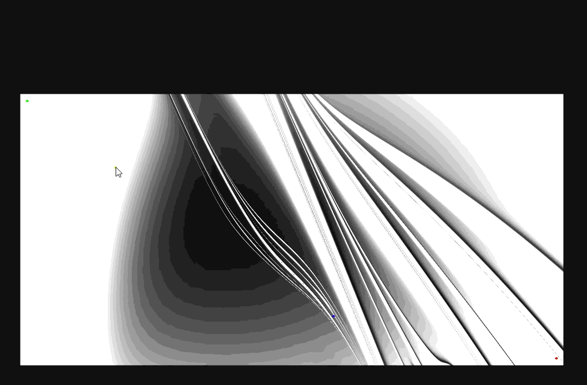
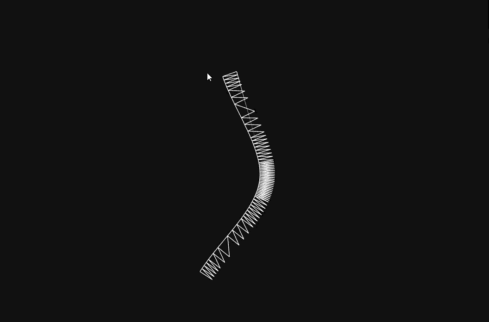
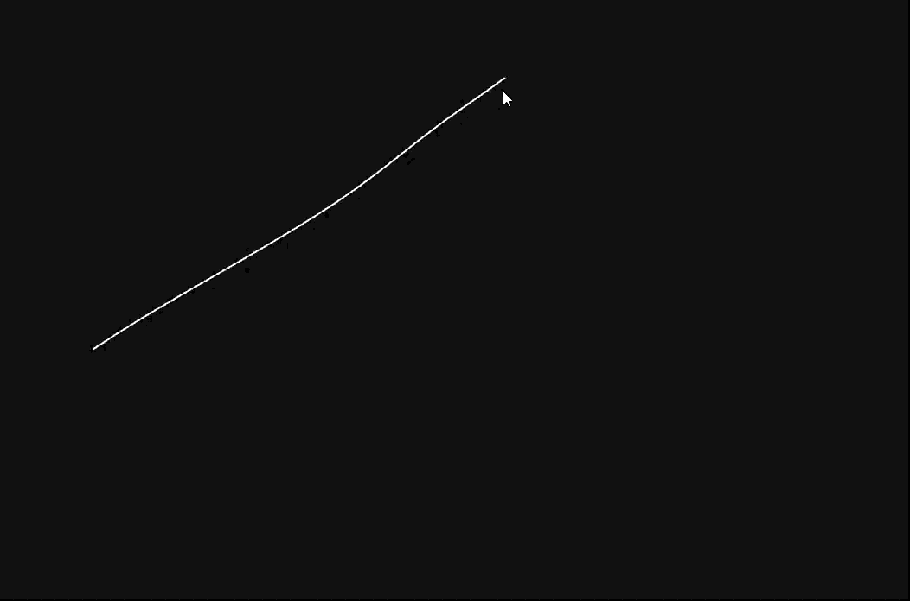

# Codex - Experiments
The goal for **Codex** is to write a series of programs to render **graphics for User Interfaces**, intended to be used as a guide, meaning they can be translated in an arbitrary programming language to be able to have **complex UIs in any environment** that supports GPU-driven graphics.

In this branch of the repository are some tests for some programs with that purpose, mostly for rendering **Bezier curves**

### Rendering Beziers with a Fragment Shader
An approach at using the fragment shader to draw a Cubic Bezier, so the only geometry sent to the GPU is a quad that contains it. The code for it can be found in commits `2e2566d` and prior.
This approach wastes too much computation on empty pixels (if the whole quad is processed by the shader), and requires to **calculate if a pixel should be drawn the colour of the curve or not**.

This can be done by finding the **minimum distance** between the curve (represented by a cubic function) and the pixel, but the resulting function is a **5th-degree polynomial** (because the calculation of the minimum can be done by deriving the distance function, and the distance function contains the cubic function squared), thus its root has to be found through an algorithm like **Newton**'s.

The image below shows the quad with each pixel colored based on how far it is from the curve (distance is mapped to the colour so shorter distance = darker colour)

While implementing Newton's Method in the fragment shader, I ran into this mesmerising bug

(gif may take a while to load)

### Current Bezier Renderer
Since relying on the fragment shader to render Beziers is slow, the current approach, given a Cubic Bezier, splits it using the **De' Casteljau segmentation** multiple times, until the resulting curves are basically a flat line, then substitutes the segments with straight lines, which can be rendered with a **single quad**.

Below is an example which shows how depending on the shape of the curve a different number of triangles is used to represent it.

(gif may take a while to load)

### Pseudo Cloth Simulation
The lines can be animated with a cloth-like simulation that uses **FABRIK** (**F**orwards **A**nd **B**ackwards **I**nverse **K**inematicks).

(gif may take a while to load)